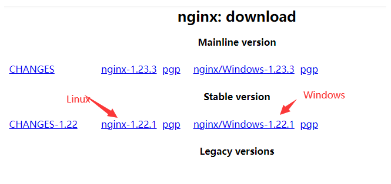
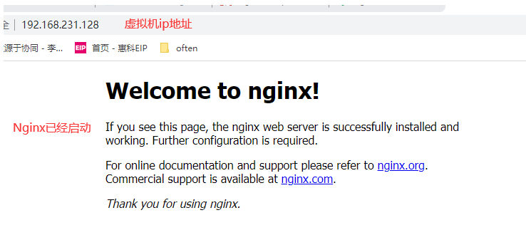

# Nginx入门

## 一、在Linux安装Nginx教程

- **下载Nginx包**

[官网下载地址](http://nginx.org/en/download.html)；




<br>

- 将下载的Nginx安装包拖拽到虚拟机目录中，我这里是放到了`root`目录下
- 进入到root目录，解压安装包

```sh
tar -zxvf  nginx-1.22.1.tar.gz #解压到当前目录

cd nginx-1.22.1 #进入解压后的文件夹
ls  #查看文件夹中的文件: configure
```

<br>

- 安装依赖库

```sh
#安装C编译器
yum install -y gcc

#安装pcre库
yum install -y pcre pcre-devel

#安装zlib
yum install -y zlib zlib-devel
```

- 安装Nginx

```sh
./configure --prefix=/usr/local/nginx #使用prefix选项指定安装的目录
make
make install
```

- 启动

```sh
cd /usr/local/nginx/sbin

ls # 里面是一个nginx的可执行文件

./nginx # 启动这个可执行
```

- 关闭虚拟机的防火墙

```sh
systemctl stop firewalld
# 禁止防火墙自启动
systemctl disable firewalld.service
```

- 在Windows浏览器输入虚拟机ip地址测试

输入ip addr查看虚拟机ip地址



<br>

## 二、Nginx命令

<br>

### 1.  停止Nginx运行

来到Nginx安装目录的sbin文件夹下：

cd /usr/local/nginx/sbin

```sh
./nginx -s stop #快速停止

./nginx -s quit #优雅停止，即Nginx处理完所有请求后，再停止
```

<br>

### 2.  重新加载配置

```sh
./nginx -s reload #重新加载配置，基于优雅停止

./nginx -t #检查nginx配置是否正确
```

<br>

### 3.  查看Nginx进程

```sh
ps -ef|grep nginx
```

<br>

### 4.  创建启动Nginx的脚本

目的：通过脚本的方式启动nginx，因为每次进入到Nginx目录下启动他的脚本太麻烦了

- 创建一个nginx.service脚本

```sh
 cd /usr/lib/systemd/system/

touch nginx.service
```

- 编辑脚本

```sh
vim usr/lib/systemd/system/nginx.service
```

- 插入如下内容：

```sh
[Unit] 
Description=nginx
After=network.target remote-fs.target nss-lookup.target

[Service]
Type=forking
#对应目录为上文的Nginx安装目录
PIDFile=/usr/local/nginx/logs/nginx.pid
ExecStartPre=/usr/local/nginx/sbin/nginx -t -c /usr/local/nginx/conf/nginx.conf
ExecStart=/usr/local/nginx/sbin/nginx -c /usr/local/nginx/conf/nginx.conf
ExecReload=/usr/local/nginx/sbin/nginx -s reload
ExecStop=/usr/local/nginx/sbin/nginx -s stop
ExecQuit=/usr/local/nginx/sbin/nginx -s quit 
PrivateTmp=true
   
[Install]   
WantedBy=multi-user.target  # 多用户
```

- 重载加载配置

```sh
cd /usr/local/nginx/sbin
./nginx -s reload #重新加载配置，基于优雅停止
```

<br>

### 5. 脚本启动与关闭Nginx

由于创建了脚本，可以在任意目录下，执行一下命令启动Nginx服务了！

```sh
systemctl start nginx.service #开启

systemctl stop nginx.service #快速关闭
```
