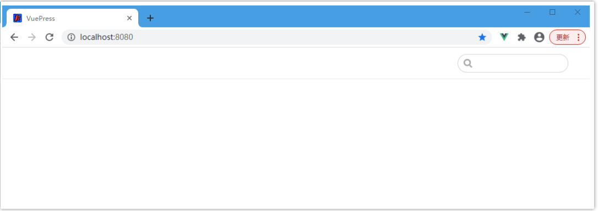
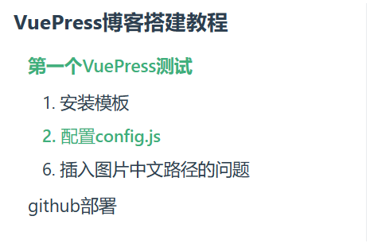
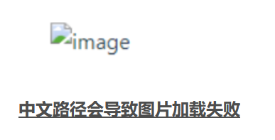
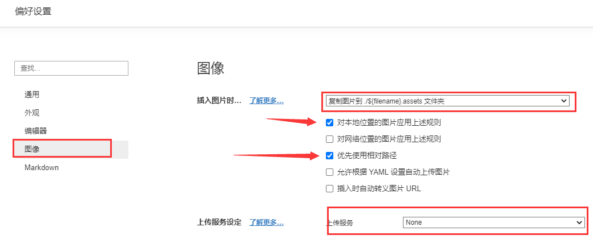
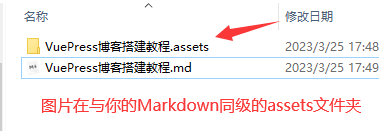
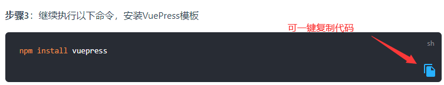
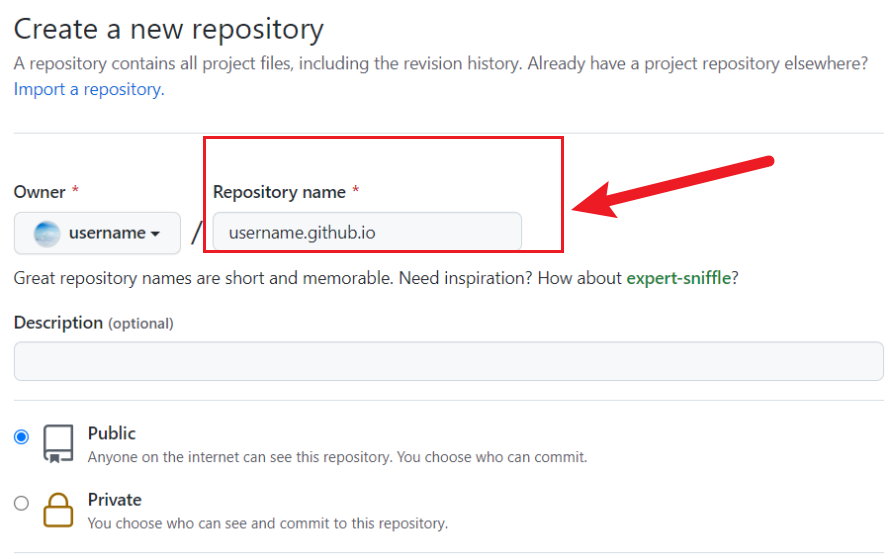
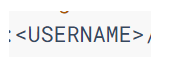

# VuePress博客搭建教程

## 一、第一个VuePress测试

### 1.  安装模板

**步骤1**：新建一个文件夹，如：`vueblog`

**步骤2**：进入`vueblog`文件夹后，打开cmd窗口，执行下面命令，一直按回车，会出现文件`package.json`，

```bash
npm init
```

**步骤3**：继续执行以下命令，安装VuePress模板

```bash
npm install vuepress
```

<br>

**步骤4**：在 `package.json` 中添加如下信息

分别是启动服务、项目部署、项目构建的命令

```json
  "scripts": {
    "start": "vuepress dev docs",
    "deploy": "bash deploy.sh",
    "build": "vuepress build docs"
  },
```

**步骤5**：在vueblog目录下新建文件夹 `docs`，`docs`文件夹中创建 `README.md`

<br>

**步骤6**：运行如下命令，启动项目

```bash
npm start
```

<br>

**步骤7**：运行访问 [http://localhost:8080/](https://links.jianshu.com/go?to=http%3A%2F%2Flocalhost%3A8080%2F)，效果如下，只有一个搜索框。默认是读取 docs/README.md，但现在没内容，所以是空白。



---

**步骤8**：按两次Ctrl + c 结束运行，然后执行命令。

```bash
npm run build
```

<br>

**步骤9**：在 docs 文件夹下新建 ui文件夹，ui文件夹下创建hello文件夹，我们开始在hello文件夹下存放我们自己的 md 文档，文件结构如下：

```txt
vueblog
├── docs
│   ├── .vuepress
│   │   │
│   │   └── dist // 编译后生成的文件夹
│   ├── ui
│   │   │
│   │   └── hello 
│   └── README.md
│   
├── node_modules
│      
└── package.json
```


<br>

### 2.   配置config.js及其他文件

#### **- 步骤1**：

在 `.vuepress` 文件夹下创建文件 `config.js`，添加如下内容

```js
module.exports = {
   title: '可贺博客', // 设置网站标题
   head: [
   // 网站logo
    ['link', {rel: 'icon', href: '/img/icon.png'}],
   //  样式
    ['link', {rel: 'stylesheet', href: '/css/style.css'}],
  ],
   //网站首页欢迎语
   description: '~ 鄙人的一些笔记汇总 ~',


   markdown:{
      //使文章的侧边栏标题可以读取到你markdown的2-4级标题
      extractHeaders:['h2','h3','h4']
   },
   
   themeConfig: {
      // 配置顶头导航栏、
      nav: require('./nav'),
      // 设置侧边栏自动读取markdown笔记的标题
      sidebar: 'auto',
   }
}
```

<br>

#### **- 步骤2**：

在在 `.vuepress` 文件夹下创建`public`文件夹，在`public`文件夹下创建`css`和`img`文件夹；

- `img`文件夹下可自行添加`logo.png`、`icon.png`，不添加不影响，可随便把图片拉入到这里测试。
- `css`文件夹下创建`style.css`如下：

```css
.navbar .site-name::before {
    height: 2.2rem;
    min-width: 2.2rem;
    margin-right: .8rem;
    vertical-align: middle;
    display: inline-block;
    content: '';
    background: url('../img/logo.png') no-repeat;
    background-size: 100%;
}
```

<br>

#### **- 步骤3**：

创建与`config.js`同级的文件：`nav.js`，内容如下：

```js
module.exports = [
    {
        text: '前端知识',
        items: [
          {text: 'VuePress博客搭建', link: '/ui/hello/test01.md'},
          {text: '函数式编程 Underscore源码分析', link: '/ui/underscore/'},
          {text: '模块化编程 自研模块加载器', link: '/ui/module/'},
        ]
      },
      // {
      //   text: '单页应用开发',
      //   items: [
      //     {text: '组件化开发 React专题', link: '/spa/react/'},
      //     {text: '组件化开发 Vue专题', link: '/spa/vue/'},
      //     {text: '现代前端工程实践方案 解锁webpack', link: '/spa/webpack/'},
      //   ]
      // },
      // {
      //   text: 'Node开发',
      //   items: [
      //       {text: 'TODO-1', link: '/node/TODO1/'},
      //       {text: 'TODO-2', link: '/node/TODO2/'},
      //       {text: 'TODO-3', link: '/node/TODO3/'},
      //   ]
      // },
      {
        text: 'Github',
        link: 'https://github.com/cola99year'
      },
]
```

<br>

#### **- 步骤4**：

编辑`docs`文件下的`README.md`文件夹，内容如下：

```markdown
---
home: true
actionText: 开始阅读 ➡
actionLink: /ui/hello/test01
features:
- title: JavaScript进阶
  details: 夯实高级开发所需基础，提升编程技能及代码设计能力，学会阅读分析源码，建立健全技术知识体系，平滑过渡高级前端开发工程师。
- title: 单页应用开发
  details: 全方位分析前端主流框架React、Vue在项目中的应用、剖析核心源码以及内核机制、核心技术点、架构设计思想等，从根源解决开发难题。
- title: 移动端APP开发
  details: 了解移动端适配常见难点，学习Dart语法，掌握控件、布局、动画、操作手势、传感器、线程网络以及交互等核心技能。
footer: MIT Licensed | © 2023-present 99年的可乐
---

```

<br>

#### **- 步骤5**：

在hello文件夹下，添加我们自己的markdown文件测试测试。命名为`test01.md`

需要知道的是：vuepress是从二级标题开始读取，并转为侧边栏的，一级标题只是给vuepress拿来当导航名字，因此我们的markdown文件的标题都要从二级标题开始了，如下图：



```markdown
# VuePress博客搭建教程
## 第一个VuePress测试
### 1.安装模板
```

<br><br>

#### - 步骤6：

npm start 启动运行！

<br>

## 二、如何在markdown中插入图片

###  1.   插入图片的中文路径问题

在markDown里引入静态资源的时候，如果路径中存在中文，会导致网页加载失败或图片加载失败，例如引入一张图片：

```

```



<br><br>


**解决方法**：

::: tip

- 安装 markdown-it-disable-url-encode

```bash
npm i markdown-it-disable-url-encode
```

- config.js引入模块

```javascript
module.exports = {
  // .....
  markdown: {
    // ......
    extendMarkdown: md => {
      md.use(require("markdown-it-disable-url-encode"));
    }
  }
};

```

:::

### 2.   配置typora图片路径

- 我们需要配置typora，在添加图片后，自动把图片保存在这个img目录下，需要如下图这样设置typora：



<br>

- 配置好后，我们的图片保存在哪？如图所示：




<br>

:warning::warning::warning:这样设置完后，**若你想分享你的Markdown笔记**，你可以创建一个文件夹，把上图的两个文件复制到文件夹中，你Markdown笔记的图片资源就可以正常显示啦，因为图片使用的是**相对路径**！

<br>

## 三、VuePress的工具插件[可选]

### 1. 实现点击图片放大

问题：浏览文章时，文章里的图片太小看不清里面的内容，VuePress不支持点击图片放大功能，如何实现？

解决方法：只需要安装 @vuepress/plugin-medium-zoom 插件就可以了

- 安装插件：

```sh
npm install -D @vuepress/plugin-medium-zoom
```


- 配置`config.js`：

```js
module.exports = {
  plugins: ['@vuepress/medium-zoom'],
}
```

- 重新打包运行测试：点击图片即可放大图片

<br>

### 2. 添加一键复制代码功能

添加如下图所示的功能：



<br>

- 安装插件：

```sh
npm install vuepress-plugin-code-copy
```

- 配置`config.js`：

```js
plugins: [['@vuepress/medium-zoom'],['vuepress-plugin-code-copy', true]],
```


<br>

## 四、​github部署

### 1.  准备工作

项目根目录下【即vueblog下】创建`deploy.sh`脚本文件，粘贴如下内容，把< USERNAME >换成你github的用户名

```sh
#!/usr/bin/env sh

# 确保脚本抛出遇到的错误
set -e

# 生成静态文件
npm run build

# 进入生成的文件夹
cd docs/.vuepress/dist

git init
git add -A
git commit -m 'message'

# 如果发布到 https://<USERNAME>.github.io
git push -f git@github.com:<USERNAME>/<USERNAME>.github.io.git master

cd ../ && rm -rf dist

```

脚本文件运行的大致过程为，首先执行npm run build打包项目文件，打包后文件位于docs/.vuepress/dist目录，因此执行cd docs/.vuepress/dist进入到目录下。

  然后目录下运行git init初始化为git仓库，暂存目录下所有文件，并做一次提交。其中message为此次提交的说明，可自主修改。

  最后再执行git push -f ... master推送至远程仓库，其中-f表示强制推送，并且使用SSH传输协议，将本地master分支推送到远端。

<br><br>

### 2.  SSH 公钥

由于此次传输协议为`SSH`方式，势必远程仓库要绑定本地的`SSH`公钥才能推送，因此介绍下本地创建`SSH key`。


自己去复习git的知识，绑定好公钥！

<br><br>

### 3.  创建仓库 

`github`上选择`New respository`，输入`Repository name`仓库名，点击`Create repository`创建仓库。

注意仓库名称必须为`username（你的用户名）+ .github.io`的方式，否则需要单独配置。



### 4.  脚本推送

`Git Bash`命令行运行`npm run deploy`，注意只能在`Git Bash`运行，否则会发生错误。

<br><br>

 若本地没有`known_hosts`文件，将会收到如下提示，输入`yes`回车即可。

<br><br>

最后收到如下信息即表示推送成功并部署在远端了，并且浏览器访问`https//username.github.io`将跳转到`Vuepress`创建的静态博客首页 。


## 五、注意事项

### < USERNAME >

我在编辑md过程中，正文中出现如下图所示的标签，直接导致网站无法加载出博客文档，应该是触发了vue语法


图：



更多玩法参考文章：[vuepress2.0使用教程（5）- md文件的玩法_](https://blog.csdn.net/baijiafan/article/details/126176064?ops_request_misc=%7B%22request%5Fid%22%3A%22167966792316782425159956%22%2C%22scm%22%3A%2220140713.130102334.pc%5Fall.%22%7D&request_id=167966792316782425159956&biz_id=0&utm_medium=distribute.pc_search_result.none-task-blog-2~all~first_rank_ecpm_v1~rank_v31_ecpm-15-126176064-null-null.142^v76^insert_down38,201^v4^add_ask,239^v2^insert_chatgpt&utm_term=Vuepress使用vue样式&spm=1018.2226.3001.4187)；